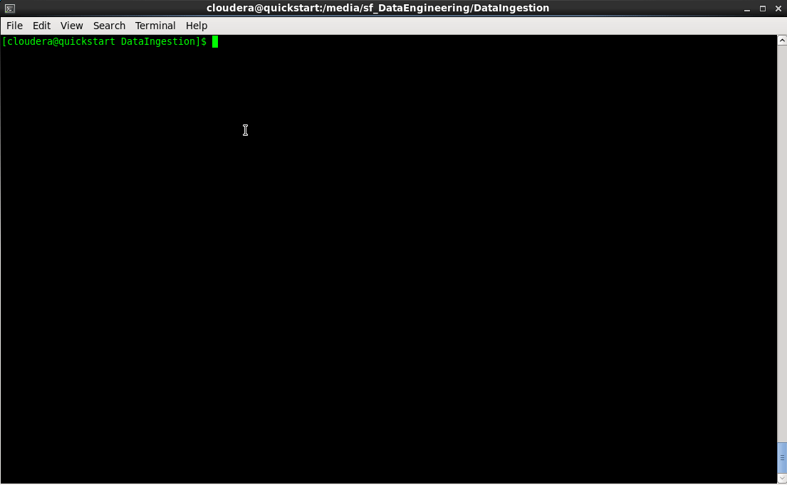

<!-- START doctoc generated TOC please keep comment here to allow auto update -->
<!-- DON'T EDIT THIS SECTION, INSTEAD RE-RUN doctoc TO UPDATE -->
**Table of Contents**

- [Data Analysis](#data-analysis)
  - [Overview](#overview)
  - [Creating an Impala Table](#creating-an-impala-table)
  - [Maximum Temperatures Measured for Every Device](#maximum-temperatures-measured-for-every-device)
  - [Amount of Data Points Aggregated for Every Device](#amount-of-data-points-aggregated-for-every-device)
  - [Highest Temperature Measured on a Given Day for Every Device](#highest-temperature-measured-on-a-given-day-for-every-device)

<!-- END doctoc generated TOC please keep comment here to allow auto update -->

# Data Analysis

## Overview

<kbd></kbd>

The purpose of this project is showcasing my HBase + Hive + Impala skills.

The project is comprised of scripts used to build an Impala table on top a HBase table and a few queries over the data produced by the Data Ingestion/Data Transformation projects.

## Creating an Impala Table

To create the table, first start the hive shell:

    hive

Then execute the following statement:

    CREATE EXTERNAL TABLE iot_devices_data (id STRING, deviceId STRING, temperature INT, latitude DOUBLE, longitude DOUBLE, time STRING)
    STORED BY 'org.apache.hadoop.hive.hbase.HBaseStorageHandler'
    WITH SERDEPROPERTIES ("hbase.columns.mapping" = ":key,Entity_Data:deviceId,Entity_Data:temperature#b,Entity_Data:latitude#b,Entity_Data:longitude#b,Entity_Data:time")
    TBLPROPERTIES("hbase.table.name" = "IoT_Devices_Data");

You should get the following output:

    OK
    Time taken: 0.821 seconds

## Maximum Temperatures Measured for Every Device

To run the query, first start the Impala shell:

    impala-shell

Then execute the following statement:

    select deviceId, max(temperature) as highest_temperature
    from iot_devices_data group by deviceid;

You should get the following output:

    Query: select deviceId, max(temperature) as highest_temperature
    from iot_devices_data group by deviceid
    Query submitted at: 2018-05-06 11:39:18 (Coordinator: http://quickstart.cloudera:25000)
    Query progress can be monitored at: http://quickstart.cloudera:25000/query_plan?query_id=ce42a1beb991e9ba:7938c8b900000000
    +--------------------------------------+---------------------+
    | deviceid                             | highest_temperature |
    +--------------------------------------+---------------------+
    | 3df20194-ddd4-3082-95b2-20b6e6ed1c4e | 18                  |
    | a37c0038-23f3-3b3f-8d9d-76651bef3c02 | -3                  |
    | d71dd0c0-464e-3d34-a158-c97f6af10f95 | 17                  |
    +--------------------------------------+---------------------+
    Fetched 3 row(s) in 11.92s

## Amount of Data Points Aggregated for Every Device

To run the query, execute the following statement on the Impala shell:

    select deviceId, count(*) as data_points
    from iot_devices_data group by deviceid;

You should get the following output:

    Query: select deviceId, count(*) as data_points
    from iot_devices_data group by deviceid
    Query submitted at: 2018-05-06 11:40:20 (Coordinator: http://quickstart.cloudera:25000)
    Query progress can be monitored at: http://quickstart.cloudera:25000/query_plan?query_id=50497c498b4e2d1f:50bd152000000000
    +--------------------------------------+-------------+
    | deviceid                             | data_points |
    +--------------------------------------+-------------+
    | 3df20194-ddd4-3082-95b2-20b6e6ed1c4e | 92          |
    | a37c0038-23f3-3b3f-8d9d-76651bef3c02 | 92          |
    | d71dd0c0-464e-3d34-a158-c97f6af10f95 | 92          |
    +--------------------------------------+-------------+
    Fetched 3 row(s) in 0.52s

## Highest Temperature Measured on a Given Day for Every Device

To run the query, execute the following statement on the Impala shell:

    select deviceId, from_timestamp(from_unixtime(unix_timestamp(time, "yyyy-MM-ddTHH:mm:ssSSS")), 'yyyy-MM-dd') as day,
           max(temperature) as highest_temperature
    from iot_devices_data group by deviceId, day;

You should get the following output:

    Query: select deviceId, from_timestamp(from_unixtime(unix_timestamp(time, "yyyy-MM-ddTHH:mm:ssSSS")), 'yyyy-MM-dd') as day,
           max(temperature) as highest_temperature
    from iot_devices_data group by deviceId, day
    Query submitted at: 2018-05-06 11:41:20 (Coordinator: http://quickstart.cloudera:25000)
    Query progress can be monitored at: http://quickstart.cloudera:25000/query_plan?query_id=e243d4730106a54f:7e4048fd00000000
    +--------------------------------------+------------+---------------------+
    | deviceid                             | day        | highest_temperature |
    +--------------------------------------+------------+---------------------+
    | 3df20194-ddd4-3082-95b2-20b6e6ed1c4e | 2018-05-06 | 18                  |
    | d71dd0c0-464e-3d34-a158-c97f6af10f95 | 2018-05-06 | 17                  |
    | a37c0038-23f3-3b3f-8d9d-76651bef3c02 | 2018-05-06 | -3                  |
    +--------------------------------------+------------+---------------------+
    Fetched 3 row(s) in 1.03s