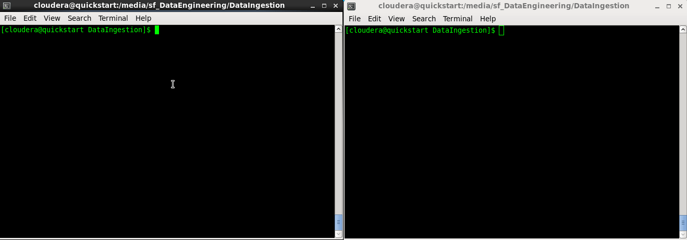

<!-- START doctoc generated TOC please keep comment here to allow auto update -->
<!-- DON'T EDIT THIS SECTION, INSTEAD RE-RUN doctoc TO UPDATE -->
**Table of Contents**

- [Data Ingestion](#data-ingestion)
  - [Overview](#overview)
  - [Running Tests](#running-tests)
  - [Installing Dependencies](#installing-dependencies)
    - [Java 8](#java-8)
    - [JSVC:](#jsvc)
    - [Kafka](#kafka)
  - [Building the App](#building-the-app)
  - [Running the App](#running-the-app)
  - [App's Configuration](#apps-configuration)
  - [Converting Markdown to HTML](#converting-markdown-to-html)

<!-- END doctoc generated TOC please keep comment here to allow auto update -->

# Data Ingestion

## Overview

<kbd></kbd>

The purpose of this project is showcasing some of my Kafka skills. The app is an UNIX service that simulates IoT devices, which persist JSON data to a Kafka topic. The messages follow the template below:

    {
        “data”: {
            “deviceId”: “11c1310e-c0c2-461b-a4eb-f6bf8da2d23c“,
            “temperature”: 12,
            “location”: {
                “latitude”: “52.14691120000001”,
                “longitude”: “11.658838699999933”
            },
            “time”: “1509793231”
        }
    }

The JSON properties are defined as following:

|Property name|Data type|Comment                                         |
|-------------|---------|------------------------------------------------|
|deviceId     |UUID     |Unique ID of the IoT device.                    |
|temperature  |Integer  |Temperature (in Celcius) measured by the device.|
|latitude     |Double   |Latitude of the position of the device.         |
|longitude    |Double   |Longitude of the position of the device.        |
|time         |Long     |Unix timestamp of the time the message was sent.|

Temperature and geographic coordinates change randomly (an one-dimensional and a two dimensional [random walk](https://en.wikipedia.org/wiki/Random_walk) respectively).

## Running Tests

To run unit tests, execute the following command on a terminal:

    $ sbt clean test

You should get the following output:

        [info] Loading project definition from /home/gualtief/workspace/Ultratendency/DataEngineering/DataIngestion/project
        [info] Set current project to DataIngestion (in build file:/home/gualtief/workspace/Ultratendency/DataEngineering/DataIngestion/)
        Waiting for lock on /home/gualtief/.ivy2/.sbt.ivy.lock to be available...
        [success] Total time: 2 s, completed 06-May-2018 11:45:57
        [info] Updating {file:/home/gualtief/workspace/Ultratendency/DataEngineering/DataIngestion/}dataingestion...
        [info] Resolving jline#jline;2.14.6 ...
        [info] Done updating.
        [info] Compiling 5 Scala sources to /home/gualtief/workspace/Ultratendency/DataEngineering/DataIngestion/target/scala-2.12/classes...
        [info] Compiling 4 Scala sources to /home/gualtief/workspace/Ultratendency/DataEngineering/DataIngestion/target/scala-2.12/test-classes...
        [info] MessageSpec:
        [info] Random message generator
        [info] - should create random message
        [info] Message random modifier
        [info] - should modify message at random
        [info] JsonSerializerSpec:
        [info] JSON Serializer
        [info] - should return JSON String for data
        2018-05-06 11:46:38 ERROR ZooKeeperServer:468 - ZKShutdownHandler is not registered, so ZooKeeper server won't take any action on ERROR or SHUTDOWN server state changes
        2018-05-06 11:46:50 ERROR ZooKeeperServer:468 - ZKShutdownHandler is not registered, so ZooKeeper server won't take any action on ERROR or SHUTDOWN server state changes
        [info] PublisherSpec:
        [info] Kafka Publisher
        [info] - should send a message to a topic
        [info] Run completed in 14 seconds, 760 milliseconds.
        [info] Total number of tests run: 4
        [info] Suites: completed 3, aborted 0
        [info] Tests: succeeded 4, failed 0, canceled 0, ignored 0, pending 0
        [info] All tests passed.
        [success] Total time: 62 s, completed 06-May-2018 11:47:00

Note the log message:

    ERROR ZooKeeperServer:468 - ZKShutdownHandler is not registered, so ZooKeeper server won't take any action on ERROR or SHUTDOWN server state changes

That's [a harmless issue with the Zookeeper](https://issues.apache.org/jira/browse/ZOOKEEPER-2795) (according to developers, the log level should have been WARN instead of ERROR). I'm using [scalatest-embedded-kafka](https://github.com/manub/scalatest-embedded-kafka) to create unit tests for the Kafka producer.

## Installing Dependencies

I'm using [Cloudera's VM](https://www.cloudera.com/downloads/quickstart_vms/5-13.html) to run this app. This VM has almost all dependencies needed for the full data engineering project:

* Apache Spark
* Apache Hadoop/HBase
* Apache Impala

The only missing dependencies are JSVC, Kafka and Java 8. The VM only supports Java 7 out-of-the-box. Installation/Upgrade instructions for all dependencies follow in the next sections.

### Java 8

On CentOS Linux:

* Download the latest Java 8 from Oracle [here](http://www.oracle.com/technetwork/pt/java/javase/downloads/jdk8-downloads-2133151.html).

* Uncompress and install under `/usr/java`, e.g., `/usr/java/jdk1.8.0_171`.

* Append `export JAVA_HOME=/usr/java/jdk1.8.0_171` to the following files as follows:

        echo "export JAVA_HOME=/usr/java/jdk1.8.0_171" >> /etc/bashrc
        echo "export JAVA_HOME=/usr/java/jdk1.8.0_171" >> /etc/default/cloudera-scm-server
        echo "export JAVA_HOME=/usr/java/jdk1.8.0_171" >> /etc/default/hadoop
        echo "export JAVA_HOME=/usr/java/jdk1.8.0_171" >> /etc/default/hadoop-0.20-mapreduce
        echo "export JAVA_HOME=/usr/java/jdk1.8.0_171" >> /etc/default/hadoop-hdfs-datanode
        echo "export JAVA_HOME=/usr/java/jdk1.8.0_171" >> /etc/default/hadoop-hdfs-journalnode
        echo "export JAVA_HOME=/usr/java/jdk1.8.0_171" >> /etc/default/hadoop-hdfs-namenode
        echo "export JAVA_HOME=/usr/java/jdk1.8.0_171" >> /etc/default/hadoop-hdfs-secondarynamenode
        echo "export JAVA_HOME=/usr/java/jdk1.8.0_171" >> /etc/default/hadoop-yarn-nodemanager
        echo "export JAVA_HOME=/usr/java/jdk1.8.0_171" >> /etc/default/spark
        echo "export JAVA_HOME=/usr/java/jdk1.8.0_171" >> /etc/default/impala
        echo "export JAVA_HOME=/usr/java/jdk1.8.0_171" >> /etc/default/zookeeper
        echo "export JAVA_HOME=/usr/java/jdk1.8.0_171" >> /etc/default/solr

Now restart all services. The easiest way is to simply reboot the machine:

    $ sudo shutdown -r 0

For my own future reference, here are the [ports used by the services in Cloudera's VM](https://www.cloudera.com/documentation/enterprise/5-2-x/topics/cdh_ig_ports_cdh5.html).

### JSVC:

The UNIX service has been implemented using [JSVC](https://commons.apache.org/proper/commons-daemon/jsvc.html) and [Apache Commons Daemon](https://commons.apache.org/proper/commons-daemon/).

You will need JSVC to start and stop this app.

On CentOS Linux:

    sudo yum install jsvc

### Kafka

     sudo yum install kafka

## Building the App

To generate a *.jar file, execute the following command on a terminal:

    sbt clean assembly

I'm using [sbt-assembly for this purpose](https://github.com/sbt/sbt-assembly) to generate a *.jar file with all dependencies.

## Running the App

Create the app's jar file:

    sbt clean assembly

Start the service:

    $ sudo -E bash bin/ingestion start

Stop the service (when you're done):

    $ sudo -E bash bin/ingestion stop

You may monitor the messages being published to the topic ("IoT_Devices") as following:

    kafka-console-consumer --bootstrap-server localhost:9092 --topic IoT_Devices --from-beginning

You should see the following output (if the service is running):

        {"data":{"deviceId":"a37c0038-23f3-3b3f-8d9d-76651bef3c02","temperature":-4,"location":{"latitude":"52.31671507692309","longitude":"11.616658325468427"},"time":"1525609143"}}
        {"data":{"deviceId":"d71dd0c0-464e-3d34-a158-c97f6af10f95","temperature":12,"location":{"latitude":"52.316639527472525","longitude":"11.61658892921582"},"time":"1525609143"}}
        {"data":{"deviceId":"3df20194-ddd4-3082-95b2-20b6e6ed1c4e","temperature":10,"location":{"latitude":"52.31664639560441","longitude":"11.61664965093685"},"time":"1525609143"}}
        {"data":{"deviceId":"a37c0038-23f3-3b3f-8d9d-76651bef3c02","temperature":-4,"location":{"latitude":"52.31672194505496","longitude":"11.616649650936852"},"time":"1525609143"}}
        {"data":{"deviceId":"d71dd0c0-464e-3d34-a158-c97f6af10f95","temperature":12,"location":{"latitude":"52.316625791208786","longitude":"11.616562905621095"},"time":"1525609143"}}

## App's Configuration

You can configure the app through the [application.conf](./src/main/resources/application.conf) file. The following parameters can be changed:

|Parameter                     |Comment                                           |Example         |
|------------------------------|--------------------------------------------------|----------------|
|brokers                       |Kafka broker host and port.                       |"localhost:9092"|
|publisher.id                  |Publisher identifier.                             |"Ingestion"     |
|topic                         |Name of the Kafka topic to publish to.            |"IoT_Devices"   |
|number.devices                |Number of devices to simulate.                    |3               |
|min.temperature.celsius       |Minimum random temperature generated (in Celsius).|-10             |
|max.temperature.celsius       |Maximum random temperature generated (in Celsius).|35              |
|min.temperature.change.celsius|Minimum random change in temperature (in Celsius).|-1              |
|max.temperature.change.celsius|Maximum random change in temperature (in Celsius).|1               |
|min.location.change.steps     |Minimum random change in location (in steps).     |3               |
|max.location.change.steps     |Maximum random change in location (in steps).     |-3              |
|centre.longitude.degrees      |Devices initial longitude (in degrees).           |11.616667       |
|centre.latitude.degrees       |Devices initial latitude (in degrees).            |52.316667       |

## Converting Markdown to HTML

For my own future reference, I'm using [grip](https://github.com/joeyespo/grip) for this purpose. To convert markdown files to HTML, run the following command where the files are located:

    grip --export
