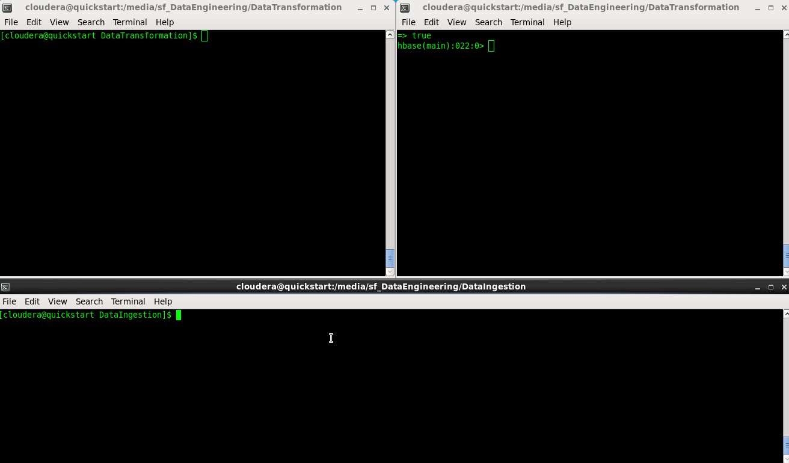

<!-- START doctoc generated TOC please keep comment here to allow auto update -->
<!-- DON'T EDIT THIS SECTION, INSTEAD RE-RUN doctoc TO UPDATE -->
**Table of Contents**

- [Data Transformation](#data-transformation)
  - [Overview](#overview)
  - [Running Tests](#running-tests)
  - [Installing Dependencies](#installing-dependencies)
  - [Building the App](#building-the-app)
  - [Creating the Table](#creating-the-table)
  - [Running the App](#running-the-app)
  - [App's Configuration](#apps-configuration)

<!-- END doctoc generated TOC please keep comment here to allow auto update -->

# Data Transformation

## Overview

<kbd></kbd>

The purpose of this project is showcasing my Spark + Spark Streaming + Kafka + HBase skills.

The app is a Spark streaming job that reads data from a Kafka topic and persist it to HBase.

## Running Tests

To run unit tests, execute the following command on a terminal:

    sbt clean test

You should get the following output:

        [info] Loading project definition from /home/gualtief/workspace/Ultratendency/DataEngineering/DataTransformation/project
        [info] Set current project to DataTransformation (in build file:/home/gualtief/workspace/Ultratendency/DataEngineering/DataTransformation/)
        [success] Total time: 0 s, completed 06-May-2018 18:11:39
        [info] Updating {file:/home/gualtief/workspace/Ultratendency/DataEngineering/DataTransformation/}datatransformation...
        [info] Resolving org.fusesource.jansi#jansi;1.4 ...
        [info] Done updating.
        [info] Compiling 6 Scala sources to /home/gualtief/workspace/Ultratendency/DataEngineering/DataTransformation/target/scala-2.10/classes...
        [info] Compiling 2 Scala sources to /home/gualtief/workspace/Ultratendency/DataEngineering/DataTransformation/target/scala-2.10/test-classes...
        [info] JsonSerializerSpec:
        [info] JSON Parser
        [info] - should parse JSON String into record
        [info] ScalaTest
        [info] Run completed in 1 second, 328 milliseconds.
        [info] Total number of tests run: 1
        [info] Suites: completed 1, aborted 0
        [info] Tests: succeeded 1, failed 0, canceled 0, ignored 0, pending 0
        [info] All tests passed.
        [info] Passed: Total 1, Failed 0, Errors 0, Passed 1
        [success] Total time: 31 s, completed 06-May-2018 18:12:09

***TODO:*** Find a way to test the streaming job, given that [spark-testing-base](https://github.com/holdenk/spark-testing-base) doesn't seem to work with [spark-streaming-kafka](https://spark.apache.org/docs/1.6.3/streaming-kafka-integration.html).

## Installing Dependencies

Refer to the [Data Ingestion Module](../DataIngestion/README.md) for instructions to build an environment using Cloudera's VM.

## Building the App

To generate a *.jar file, execute the following command on a terminal:

    sbt clean assembly

***NOTE:*** To create jobs compatible with Cloudera VM's Spark, the newest version I could use is Spark 1.6.3.

## Creating the Table

To create the HBase table, first start the Hbase shell on a terminal:

    hbase shell

Then execute the following statement:

    create 'IoT_Devices_Data', 'Raw_Data', 'Entity_Data'

To do a select on the table, execute the following statement:

    scan 'IoT_Devices_Data'

To drop the table, execute the following statements:

    disable 'IoT_Devices_Data'
    drop 'IoT_Devices_Data'

## Running the App

To run the Spark job, execute the following command on a terminal:

    spark-submit --master local[2] --class "dataengineering.datatransformation.Transformation" /media/sf_DataEngineering/DataTransformation/target/scala-2.10/DataTransformation-assembly-1.0.jar

## App's Configuration

You can configure the app through the [application.conf](./src/main/resources/application.conf) file. The following parameters can be changed:

|Parameter       |Comment                                         |Example           |
|----------------|------------------------------------------------|------------------|
|hbase.table     |The name of the HBase table to persist the data.|"IoT_Devices_Data"|
|spark.job.name  |The name of the Spark Streaming job.            |"Transformer"     |
|hbase.zookeeper |HBase Zookeeper host and port.                  |"localhost:2181"  |
|kafka.zookeeper |Kafka Zookeeper host and port.                  |"localhost:2181"  |
|kafka.topic     |Name of the Kafka topic to consume from.        |"IoT_Devices"     |
|kafka.partitions|Number of Kafka partitions.                     | 1                |

